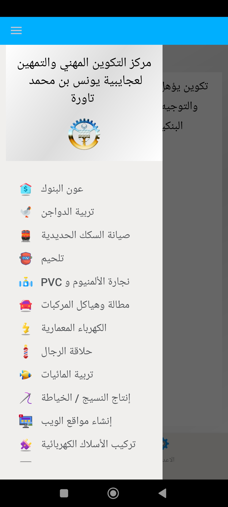

# 📱 CFPA Specialties Explorer (Unofficial Android App)

An unofficial Android application that provides access to a structured catalog of professional training specialties (CFPA programs).
The app helps users explore available learning paths, discover vocational skills, and identify training opportunities across multiple sectors.

⚠️ This application is not affiliated with any government institution or official CFPA organization. It is built for informational and educational purposes only.

🎯 Purpose

This app is designed to make it easier for users to:

Browse available professional training specialties
Discover skill-based learning programs
Explore different fields of vocational education
Understand available career pathways
Quickly access structured training information in one place
📚 Features
🗂️ Full list of training specialties organized by field
🔎 Search functionality for quick discovery of programs
📌 Detailed specialty descriptions (where available)
🎓 Categorization by sectors (e.g. IT, construction, agriculture, services, etc.)
📱 Simple and lightweight Android UI
🌍 Offline-friendly data access (if implemented)
🏗️ Data Source

The application is based on publicly available information from vocational training platforms such as:

National training catalogs and CFPA-style specialty lists
Public educational and vocational resources

Example reference structure includes national vocational training systems listing hundreds of specialties across multiple sectors.

⚙️ Tech Stack
Android (Kotlin / Java)
RecyclerView for lists
JSON / API-based or local database storage (depending on implementation)
Material Design UI components
🚀 Installation

Clone the repository:

git clone https://github.com/tari9bro/CFPA_Taoura_Android_App.git

Open the project in Android Studio, sync Gradle, then run on emulator or device.

## 🤝 Contributing

Contributions are welcome! To get started:

1. Fork this repository.
2. Create a new branch: `git checkout -b feature/YourFeature`.
3. Commit your changes: `git commit -m "Add some feature"`.
4. Push to the branch: `git push origin feature/YourFeature`.
5. Open a Pull Request describing your changes.

Please ensure any new code includes appropriate tests and documentation.

📌 Disclaimer

This project is an independent educational tool.
It does not represent or replace any official CFPA or government platform.

All training information is aggregated from publicly available sources and may change over time.

📄 License

This project is open-source under the MIT License.